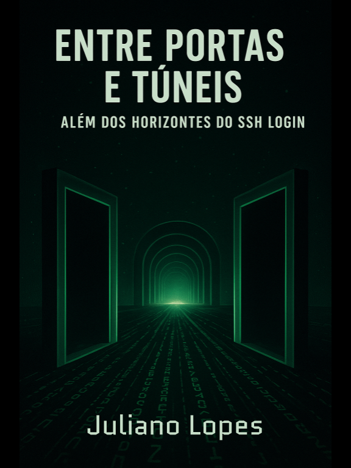

# Entre Portas e Túneis: Além dos horizontes do SSH Login

---

## 📘 Mini ebook sobre SSH e Port Forwarding 
Escrito como parte de um desafio do bootcamp **Fundamentos de IA Generativa** ([DIO](https://web.dio.me/) + [Santander](https://www.santanderopenacademy.com/pt_br/index.html) + [Universia](https://www.universia.net/br/home)).

Este conteúdo aborda, de forma simples e prática:

O problema que o SSH veio resolver.

Utilização do SSH no dia a dia, segurança e boas práticas.

Tunelamento e port forwarding (local, remoto e dinâmico), com exemplos de comandos e ilustrações.

## 🔑 Por que esse ebook?

Sempre gostei do tema **SSH** e percebi que havia pouco material acessível sobre *port forwarding*. O objetivo deste ebook é compartilhar conhecimento de forma didática, prática e acessível, ajudando iniciantes e curiosos a explorarem esse recurso poderoso.

## 🛠️ Tecnologias e ferramentas utilizadas

ChatGPT → Criação do conteúdo e ilustrações conceituais.

Google Slides → Layout e diagramação do ebook.

DALL·E 3 → Capa e esquemas visuais.

📂 Acesse o ebook completo

👉 [Clique aqui](./output/ebook-ssh.pdf) para ler o ebook em **PDF**

## ✨ Autor

Juliano Lopes

[LinkedIn](https://www.linkedin.com/in/juliano-lopes-votorantim-sp/)

[GitHub](https://github.com/ju-c-lopes)

## 📜 License
This work is licensed under a [Creative Commons Attribution 4.0 International License (CC BY 4.0)](https://creativecommons.org/licenses/by/4.0/).

© 2025 Juliano Lopes

